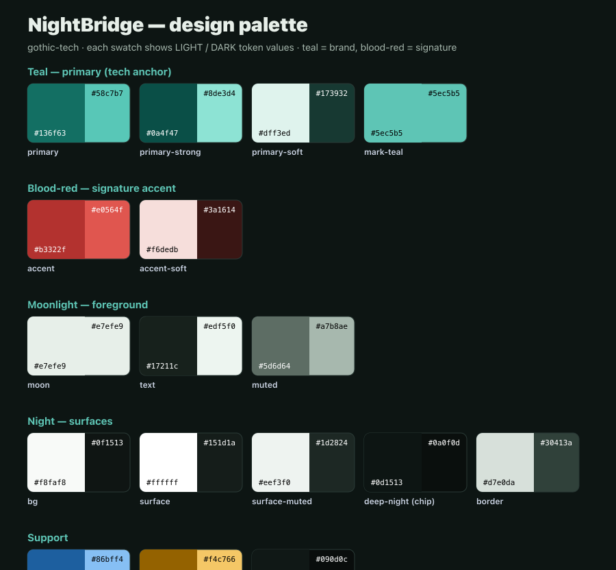

# NightBridge — brand & palette

Gothic-tech: a cool, moonlit teal system (the tech anchor) with a single
blood-red signature accent (the Castlevania soul). Night backgrounds, moonlight
foregrounds. Tasteful gothic, never a game pastiche.

## Logo

The mark is a **gothic bridge**: a deck carried by a pointed (ogival) arch on
piers, with P2P endpoint nodes at the deck ends, a **small full moon** offset to
the upper right (a nod to LocalSend's circular motif, with perspective), and a
**blood-red lantern** at the keystone.

- Structure: teal. Moon: pale moonlight on dark contexts, themed teal in the
  site header (so it reads in light and dark mode). Lantern: blood-red.
- `site/favicon.svg` — full mark on a dark rounded chip (legible 16–48 px).
- `site/og.png` — social card; teal→red gradient rule ties the palette.
- Header: inline SVG using CSS tokens (`.nb-struct`, `.nb-moon`, `.nb-node`,
  `.nb-accent`) so it themes automatically.
- Clear space ≈ the moon's diameter. Don't recolor the lantern, stretch the
  mark, or add the cross/religious motifs explored during design.

## Tokens

Each token has a light and a dark value; the site exposes them as CSS custom
properties in `site/styles.css` (`:root` and `prefers-color-scheme: dark`).

| Token | Role | Light | Dark |
|-------|------|-------|------|
| `--color-primary` | Brand / interactive | `#136f63` | `#58c7b7` |
| `--color-primary-strong` | Emphasis, logo structure | `#0a4f47` | `#8de3d4` |
| `--color-primary-soft` | Tints, chips | `#dff3ed` | `#173932` |
| mark-teal | Logo stroke on dark art | `#5ec5b5` | `#5ec5b5` |
| `--color-accent` | **Blood-red signature** | `#b3322f` | `#e0564f` |
| `--color-accent-soft` | Accent tint | `#f6dedb` | `#3a1614` |
| moon | Logo moon on dark art | `#e7efe9` | `#e7efe9` |
| `--color-text` | Foreground text | `#17211c` | `#edf5f0` |
| `--color-muted` | Secondary text | `#5d6d64` | `#a7b8ae` |
| `--color-bg` | Page background | `#f8faf8` | `#0f1513` |
| `--color-surface` | Cards | `#ffffff` | `#151d1a` |
| `--color-surface-muted` | Recessed surfaces | `#eef3f0` | `#1d2824` |
| deep-night | OG / favicon chip | `#0d1513` | `#0a0f0d` |
| `--color-border` | Hairlines | `#d7e0da` | `#30413a` |
| `--color-blue` | Links / "preview" | `#1d5f9f` | `#86bff4` |
| `--color-warning` | "coming soon" status only | `#946200` | `#f4c766` |
| `--color-code-bg` | Code blocks | `#101816` | `#090d0c` |

## Usage rules

- **Teal carries the brand.** Primary actions, links, the logo, most accents.
- **Blood-red is a signature, not a system color.** Use it sparingly — the logo
  lantern, genuine danger/critical states, a rare deliberate highlight. It is
  the complement of teal, so a little goes a long way. Never use it for large
  fills or as a second brand color.
- **Moonlight pale (`#e7efe9`) is for dark contexts only** (it vanishes on light
  surfaces). On the light site, use `--color-text` / teal instead.
- **Gold is status-only.** It appears solely on the "coming soon" badge; it is
  **not** a brand color and must not pair with teal as a primary palette (warm
  vs cool clash).
- Prefer the existing CSS tokens over raw hex so light/dark stay in sync.
